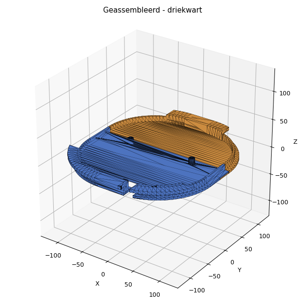
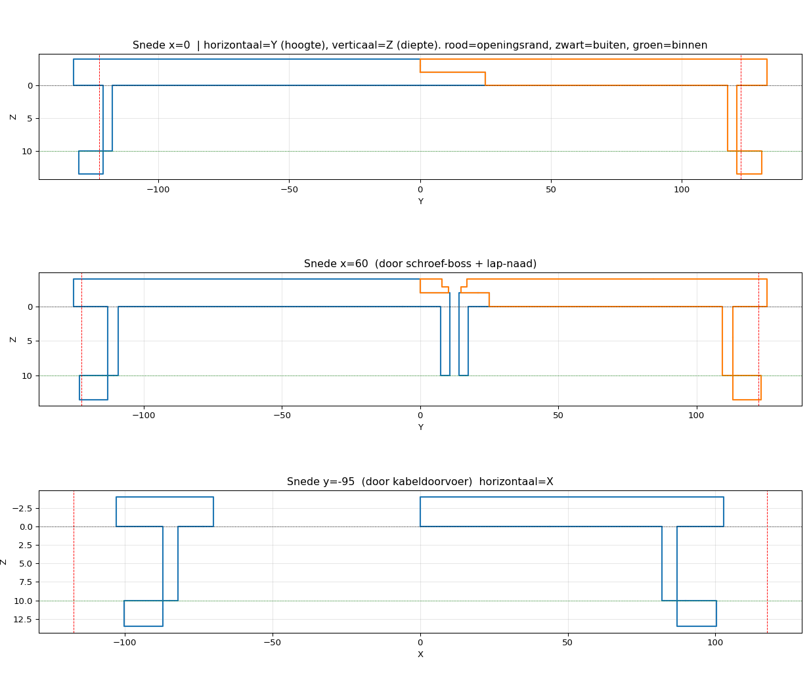
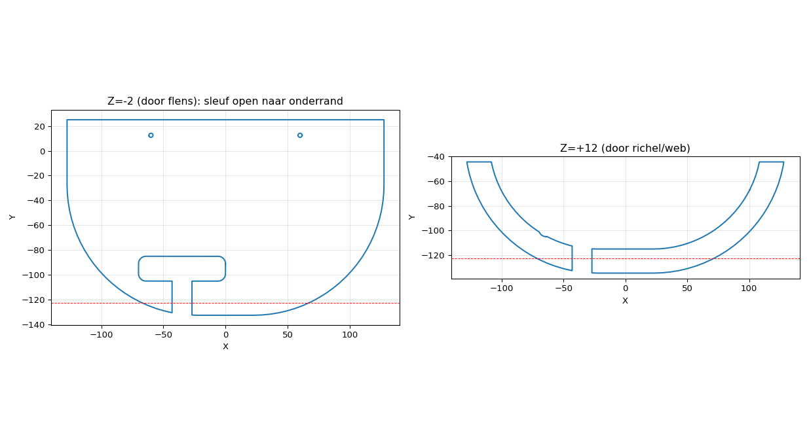

> ℹ️ **Deze tekening is verhuisd naar de algemene repo: https://github.com/brennyc86/3d-modellen (map `afdekplaat-scheepsopening`).** Daar staat de actuele versie.

# BKOS – Afdekplaat scheepsopening (2-delig)

3D-printbaar afdekplaatje voor een opening in het schot, zodat de kat niet bij de
zware/gevaarlijke elektrakabels kan. Parametrisch ontworpen: alle maten staan
bovenaan `afdekplaat.py` en zijn met één getal aan te passen.



## Het ontwerp in het kort

De opening is **235 mm breed × 245 mm hoog**, met **flink afgeronde hoeken (~10 cm
radius)** in een schot van **±10 mm dik**. Omdat het gat met de hand gezaagd is, zit
er overal **1,5 mm speling** op de insteek.

Twee delen die in elkaar haken en met 2 schroeven van buitenaf vastzitten:

| Onderdeel | Hoe het vastzit |
|---|---|
| **ONDER** | Schuin insteken → onderrichel achter de binnenkant → omhoog draaien tot hij valt. Flens buiten houdt 'm tegen indrukken, richel binnen tegen eruit vallen. |
| **BOVEN** | Bovenrichel grijpt achter de binnenkant-boven; de zijkanten steunen op de buitenflens. De onderrand overlapt het onderdeel (lap-naad). |
| **Verbinding** | 2 schroeven van buitenaf door de lap-naad klemmen boven + onder aan elkaar → het geheel kan niet meer los. |

Verder:
- **Stevige richel met vol contact.** De richel is geen dun lipje meer maar een
  massieve beugel: een **web** loopt over de volle hoogte (van de flens tot de top
  van de richel) mee omhoog, zodat de richel niet kan wegbuigen/'zweven'. De lip
  klemt met een **12 mm breed vlak** tegen de achterkant van het schot, met **0,3 mm
  voorspanning** zodat hij strak trekt. Zet `WAND` op je **gemeten** schotdikte voor
  de beste klem.
- **Buitenflens** grijpt rondom **4 mm** over de rand → dekt de handgezaagde kant af (kat-dicht). Compact gehouden zodat het geheel **±243 mm** breed blijft en op een Bambu A1 (256 mm) past met marge. Meer overlap willen om een grovere zaagrand te verbergen? Verhoog `FLENS_OVER` (let op de bedmaat).
- **Kabeldoorvoer** links-onder: gat van **70 × 20 mm**, met een **open toegangssleuf (16 mm) naar de onderrand**. Zo kun je de plaat **over reeds aangesloten kabels** leggen (kabels hoeven niet losgekoppeld) — laat de plaat zakken en de kabels glijden via de sleuf in het gat. Stem `SLEUF_B` af op je kabelbundel; de resterende ruimte kun je na montage opvullen (tule/grommet) om het kat-dicht te houden.
- Zijkanten hebben **geen** haak (alleen buitenflens) — precies zoals gevraagd.

### Doorsneden (bewijs dat het mechaniek klopt)



- Rood = rand van de opening, zwart stippel = buitenkant schot (Z=0), groen = binnenkant (Z=10).
- Links flens + insteekrand + onderrichel (web + lip) die vol áchter het schot klemt; rechts idem met bovenrichel; midden de lap-naad (binnen- + buitenhelft samen vol, buitenkant vlak).
- De richel-lip ligt met zijn onderkant net vóór de groene lijn (Z=9,7): de 0,3 mm voorspanning waarmee hij tegen de achterkant van het schot trekt.

## Bestanden

| Bestand | Wat |
|---|---|
| `afdekplaat_onder.stl` | Onderdeel — klaar om te printen |
| `afdekplaat_boven.stl` | Bovendeel — klaar om te printen |
| `afdekplaat.py` | Parametrische bron (Python: shapely + trimesh + manifold3d) |
| `snede.py` / `render.py` | Genereren de doorsneden en previews |

## Printen

> ✅ **Bedmaat:** de delen zijn ±**243 mm** breed × **160 mm** hoog → past ruim op een
> **Bambu Lab A1 (256 × 256 mm)** met marge. Op een 220-bed: **45° gedraaid** printen.

- **Oriëntatie:** flens-kant op het bed (de platte buitenkant naar beneden).
- **Support:** nodig onder de binnenrichels (de lip steekt 12 mm over). Slicer zet die automatisch; alleen daar. Rest is support-vrij.
- **Materiaal:** PETe of ASA i.v.m. vocht/UV op een boot (PLA kan, maar minder bestendig).
- **Wanden/infill:** 4 wanden, 25–30 % infill is ruim voldoende; dit is geen dragend deel.
- **Schroeven:** 2× **M4 zelftappend, ±16 mm** (RVS A4 voor op het water). Voorboorgaten Ø3,3 zitten al in de bossen. Upgrade-optie: heat-set inserts + M4 machineschroef.

## Monteren

1. **Onderdeel** schuin in de opening steken, onderhaak achter de binnenkant haken, omhoog draaien tot de flens vlak ligt.
2. **Bovendeel** met de bovenhaak achter de binnenkant-boven haken, naar beneden draaien; de onderrand legt over het onderdeel.
3. 2 schroeven van buitenaf door de lap-naad in de bossen draaien. Klaar.
4. Kabels: leg de plaat over de bestaande kabels — ze glijden via de open sleuf in het kabelgat. Vul daarna de speling rond de kabels op (tule/grommet/kit) voor een nette, kat-dichte afsluiting.



## Maten aanpassen

Open `afdekplaat.py`, pas de parameters bovenaan aan en draai opnieuw:

```bash
pip install --break-system-packages numpy shapely trimesh manifold3d
python3 afdekplaat.py          # schrijft de twee STL's
python3 snede.py && python3 render.py   # optioneel: plaatjes
```

Handige knoppen:
- `WAND` – **meet je echte schotdikte na**; bepaalt de klem (flens vóór ↔ richel achter).
- `MARGE` – speling in het gat (groter = ruimer, makkelijker passen).
- `FLENS_OVER` – hoeveel de flens over de rand grijpt (en de totale buitenmaat).
- `OPENING_R` – **meet je echte hoekradius na** en zet 'm hier.
- `HAAK_OVER` – breedte van het contactvlak van de richel achter het schot.
- `HAAK_VOORSPAN` – voorspanning waarmee de richel klemt (groter = strakker; te groot = past niet).
- `WEB_DIK` – hoe massief de richel aan de flens vastzit (tegen wegbuigen).
- `KABEL_*` – plek/maat van het kabelgat.
- `SLEUF_AAN` / `SLEUF_B` / `SLEUF_X` / `SLEUF_NAAR` – de open toegangssleuf. `SLEUF_NAAR` = `"onder"`, `"links"` of `"rechts"` (naar welke rand de sleuf loopt). `SLEUF_AAN=False` maakt er weer een dicht gat van.

## Belangrijk: eerst test-passen

Het gat is handgezaagd. Print eventueel eerst een **strook van de rand** (of accepteer
dat v1 een test-fit is) en stel `MARGE` / `OPENING_R` bij vóór de definitieve print.
